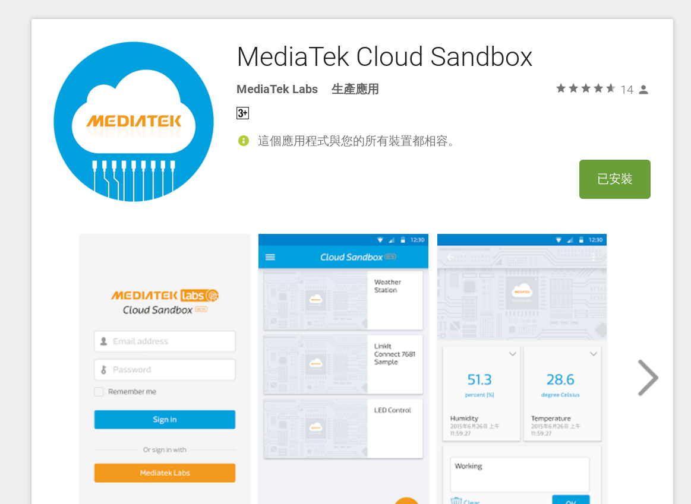

# 7688 Duo 手臂程式設計

根據前面的設定，
我們已經完成了MCS網站上的設定，
也成功接收到雲端上發送過來的訊號，
接下來我們就只要把7688控制機械手臂的部份，
也就是Arduino的部份完成就大公告成囉！


機械手臂的接線部份，
請按照前面接上手臂夾爪的方式，
將其他三顆伺服馬達的電源線共接，
地線共地，
並把訊號線按照下面Arduino程式中的設定接到相對應的腳位。
您可以不使用範例程式中的腳位，
只要記得兩件事情，
7688 Duo的__PWM腳位__只有D3，D5，D6，D9，D10，D11，D12，D13，
所以如果要替換成你想要的腳位，
請記得挑以上所題的這幾隻腳，
並且千萬要記得在__Arduino的程式端__改寫您對應的腳位編號。


首先請開啟您的Arduino IDE並下載以下的程式碼到7688中，
請注意，下面程式碼當中的各個伺服馬達的角度會因為不同的機械手臂而有所不同，  請您針對您的機械手臂進行微調，
基本上只要不會讓伺服馬達卡死即可。


```c
  
#include <Servo.h>

Servo servo_gripper;
Servo servo_base;
Servo servo_updown;
Servo servo_frontback;

int degree_base      = 180;           //設定初始角度，請依照您的機械手臂做微調
int degree_updown    = 90;
int degree_frontback = 90;

void setup()
{
    Serial.begin(115200);
    Serial1.begin(57600);             //建立Arduino ATMega32U4與MT7688AN之間的連結
    servo_gripper.attach(3);          //將夾爪的伺服馬達的腳位指定給3號腳位
    servo_updown.attach(5);           //將升降的伺服馬達的腳位指定給5號腳位
    servo_frontback.attach(6);        //將前後的伺服馬達的腳位指定給6號腳位
    servo_base.attach(9);             //將平台的伺服馬達的腳位指定給9號腳位
}


void loop()
{
    if(Serial1.available())
    {
        int command = Serial1.read(); //讀取MT7688AN送來的指令
        if(command == 'o')            //如果是o的話，就打開夾爪
        {
            Serial.println("gripper open");
            servo_gripper.write(160);
        }
        else if(command == 'f')       //如果是f的話，就合起夾爪
        {
            Serial.println("gripper closed");
            servo_gripper.write(30);
        }
        else if(command == 'u')       //如果是u的話，就上升手臂
        {
            degree_updown = (++degree_updown > 180) ? 180 : degree_updown;
            Serial.print("degree_updown");
            Serial.println(degree_updown);
            servo_updown.write(degree_updown);
        }
        else if(command == 'd')       //如果是d的話，就下降手臂
        {
            degree_updown = (--degree_updown < 0) ? 0 : degree_updown;
            Serial.print("degree_updown");
            Serial.println(degree_updown);
            servo_updown.write(degree_updown);
        }
        else if(command == 'a')       //如果是a的話，就前伸手臂
        {
            degree_frontback = (++degree_frontback > 180) ? 180 : degree_frontback;
            Serial.print("degree_frontback: ");
            Serial.println(degree_frontback);
            servo_frontback.write(degree_frontback);
        }
        else if(command == 'b')       //如果是b的話，就後縮手臂
        {
            degree_frontback = (--degree_frontback < 0) ? 0 : degree_frontback;
            Serial.print("degree_frontback: ");
            Serial.println(degree_frontback);
            servo_frontback.write(degree_frontback);
        }
        else if(command == 'l')       //如果是l的話，就左轉平台
        {
            degree_base = (++degree_base > 180) ? 180 : degree_base;
            Serial.print("degree_base: ");
            Serial.println(degree_base);
            servo_base.write(degree_base);
        }
        else if(command == 'r')       //如果是r的話，就右轉平台
        {
            degree_base = (--degree_base < 0) ? 0 : degree_base;
            Serial.print("degree_base: ");
            Serial.println(degree_base);
            servo_base.write(degree_base);
        }
    }
}

```


接下來請在7688打上以下的程式碼，
以完成7688在MCS與Arduino間的溝通。


```python

# -*- coding: utf-8 -*-

import requests
import serial

s = serial.Serial("/dev/ttyS0", 57600)

device_id = "DZF34Y80"          # 改成您的device id
device_key = "B0df4jYfaxQ0BwK9" # 改成您的device key
data_channel = "gamepad"        # 改成您遊戲手把的data channel id
data_channel2 = "gripper"       # 改成您開關控制的data channel id


url = "http://api.mediatek.com/mcs/v2/devices/" + device_id
url += "/datachannels/" + data_channel + "/datapoints.csv"

url2 = "http://api.mediatek.com/mcs/v2/devices/" + device_id
url2 += "/datachannels/" + data_channel2 + "/datapoints.csv"

def game_pad():  # 接受MCS gamepad資料通道的訊號 
    r = requests.get(url, headers = {"deviceKey" : device_key})
    data = r.content.split(',')[2:]
    return (data[0][0], data[0][-1])

def gripper():   # 接收MCS gripper資料通道的訊號
    r = requests.get(url2, headers = {"deviceKey" : device_key})
    return r.content[-1]

while True:      # 判斷接收到的訊號，並發送相對應的指令給Arduino端
    command = game_pad()
    command2 = gripper()
    if command[1] == "1":
        if command[0] == "l":
            print "press left"
            s.write("l")
        elif command[0] == "r":
            print "press right"
            s.write("r")
        elif command[0] == "u":
            print "press up"
            s.write("u")
        elif command[0] == "d":
            print "press down"
            s.write("d")
        elif command[0] == "A":
            print "press A"
            s.write("a")
        elif command[0] == "B":
            print "press B"
            s.write("b")
    if command2 == "1":
        print "closed"
        s.write("f")
    elif command2 == "0":
        print "open"
        s.write("o")

```


接下來就請試著從雲端上操控機械手臂囉！
如果您還完不過癮，想從手機上來操控，
也可以試著從手機的app store下載官方的雲端應用程式，
直接從手機上來控制喔！


