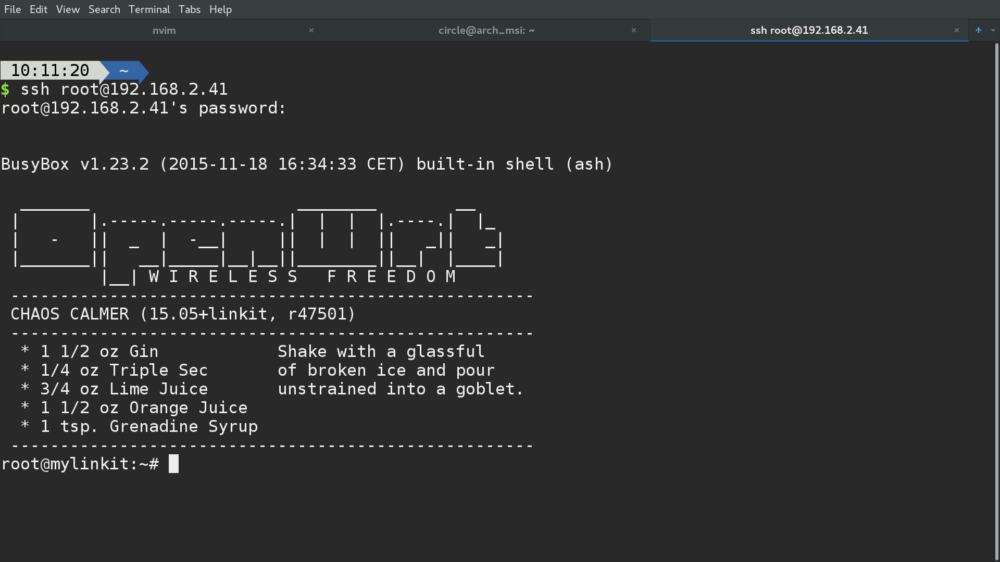
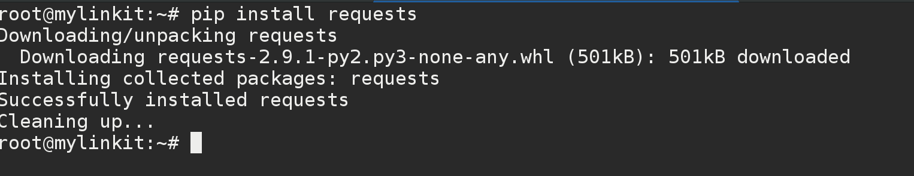

# 7688手臂程式設計

1. 準備好軟體套件

    * 接下來進到7688端的程式設計，
      請先參照前面的作法，
      在電腦端由ssh登入7688，
      確認您的7688目前是設定成__Station mode__，
      並能夠成功連到網路。

    

    * 下載Python網路溝通用的函式庫：_requests_，
      請在console輸入_pip install requests_。

    

    * 在console中輸入：_nano_，開啟nano編輯器，
      輸入以下的程式碼。

```python
    import mraa
    import time
    import requests

    device_id = "DFQ7iS0G"
    device_key = "qaBPk8U49z0n1cPs"
    data_channel = "gamepad"
    url = "http://api.mediatek.com/mcs/v2/devices/" + device_id 
    url += "/datachannels/" + data_channel + "/datapoints.csv"

    def game_pad():
        r = requests.get(url, headers = {"deviceKey" : device_key})
        data = r.content.split(',')[2:]
        print data
        return (data[0][0], data[0][-1])


    pin = [3, 5, 6, 9]
    servo = []
    servo_degree = [90, 90, 90, 180]
    for p in pin:
        servo.append(mraa.Pwm(p))
        
    for s in servo:
        s.period_us(20000) #50Hz
        s.enable(False)

    max_duty = 2300.0 #us
    min_duty = 500.0

    def servo_rotate(servo_number, degree): #servo_number (0, 1, 2, 3) = (3, 5, 6, 9)
        duty_cycle = ((max_duty - min_duty) * degree / 180.0 + min_duty) / 20000.0
        servo[servo_number].enable(True)
        servo[servo_number].write(duty_cycle)
        print "duty_cycle = ", duty_cycle, "\n"

    dt = 0.01

    for s in servo:
        s.enable(False)

    unit_degree = 30
    while True:
        command = game_pad()
        if command[1] == "1":
            if command[0] == "l":
                print "left"
                if servo_degree[0] > unit_degree:
                    servo_degree[0] -= unit_degree
                    servo_rotate(0, servo_degree[0])
            elif command[0] == "r":
                print "right"
                if servo_degree[0] < 180 - unit_degree:
                    servo_degree[0] += unit_degree
                    servo_rotate(0, servo_degree[0])
            elif command[0] == "d":
                print "down"
                if servo_degree[2] < 180 - unit_degree:
                    servo_degree[2] += unit_degree
                    servo_rotate(2, servo_degree[2])
            elif command[0] == "u":
                print "up"
                if servo_degree[2] > unit_degree:
                    servo_degree[2] -= unit_degree
                    servo_rotate(2, servo_degree[2])
            elif command[0] == "A":
                print "A"
                servo_rotate(3, 0)
            elif command[0] == "B":
                print "B"
                servo_rotate(3, 180)

```
* 您也可以從以下的網址將程式碼直接下載下來:https://goo.gl/t0QiKH

