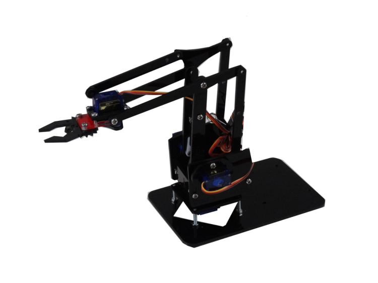

# 雲端控制機械手臂

本章將帶您一探機械手臂的世界，
並介紹基本的伺服馬達控制及原理，
關於機械手臂的部份，
您可以自行設計自己的機械手臂，
或者是參考網路上許多免費資源來製作，
本範例將使用的是一款開源機械手臂meArm。

程式語言的部份主要使用的是Python，
如果您喜歡使用其他的語言，
例如：Arduino， Node.js，
也請參考本章末的附錄，
裡面將會有詳細的解說。

 
    meArm官方網站: http://mearm.weebly.com/ 

