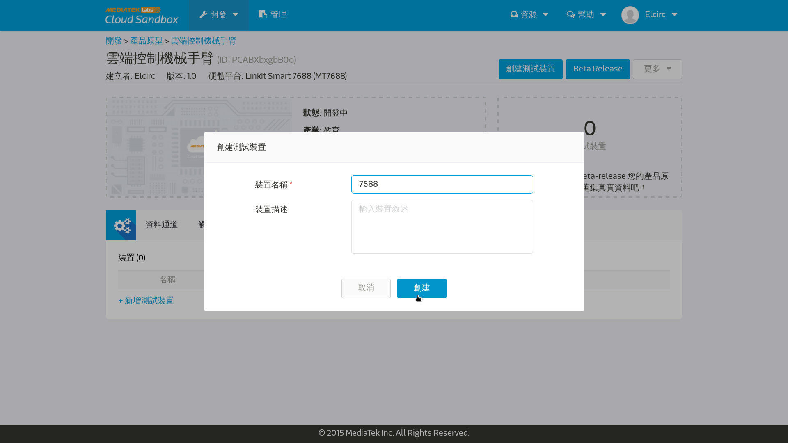

# MCS控制夾爪

* 本範例將實做MCS雲端控制夾爪，
  整個控制系統的概念其實很直觀，
  首先我們先在MCS雲端網站上增設一個資料通道，
  並設定為開關，當我們再網站上撥動開關時，
  就會透過網路傳送開關狀態給7688，
  而7688則在接受到訊號後，做出相對應的馬達動作。
  以下分成三個步驟帶您一步一步完成設定：


* __PART I__: 
  MCS雲端網站設定
  1. 首先我們先登入我們的雲端MediTek Cloud Sandbox
    * 網址：https://mcs.mediatek.com/zh-TW/
    

    * 點選登入,進到console端裡面
    

  2. 建立開發原形
    * 進入開發，新建立一個開發原型
    

    * 編輯原型
    

    * 進入原型
    

  3. 按鈕控制資料通道

    * 新增資料通道
    

    * 新增控制器，選擇按鈕控制器,這裡再提醒一次,
      __資料通道名稱__是給雲端網站代表資料通道用的,
      而__資料通道Id__是給機器辨識用的，所以要用英文。
    

    * 完成後點選測試裝置，並新增一個測試裝置

    

    

    

    * 右上角的__DeviceId__跟__DeviceKey__非常重要，
      他們扮演的角色就是待會7688要跟MCS雲端溝通的通行證。


* __PART II__: mcs_gripper.ino 
  請打開您的Arduino IDE下載以下程式碼到7688中，
  執行手臂夾爪的控制程式。

```c
#include <Servo.h>

Servo s;

void setup()
{
    Serial1.begin(57600);             //建立Arduino ATMega32U4與MT7688AN之間的連結
    s.attach(3);                      //將伺服馬達的腳位指定給3號腳位
}

void loop()
{
    if(Serial1.available())
    {
        int command = Serial1.read(); //讀取MT7688AN送來的指令
        if(command == 'o')            //如果是o的話，就打開夾爪
            s.write(160);
        else if(command == 'f')       //如果是f的話，就合起夾爪
            s.write(30);
    }
}
```
* __PART III__: mcs_gripper.py 
  接下來請登入7688，並執行以下的程式碼，
  接收雲端網站的控制訊號。


```python

import requests
import serial

s = serial.Serial("/dev/ttyS0", 57600)

device_id = "DZF34Y80"          # 改成您的device id
device_key = "B0df4jYfaxQ0BwK9" # 改成您的device key
data_channel = "gripper"        # 改成您的data channel id

url = "http://api.mediatek.com/mcs/v2/devices/" + device_id
url += "/datachannels/" + data_channel + "/datapoints.csv"

while True:
    r = requests.get(url, headers = {"deviceKey" : device_key}) # 讀取MCS上夾爪控制開關的訊號
    print r.content
    data = r.content.split(",")[2]
    if data == "1":             # 如果從MCS收到1，代表要開夾爪
        s.write("o")
    else if data == "0":        # 如果從MCS收到0，代表要閉夾爪
        s.write("f")

```

* 是不是能夠在MCS網站上透過按鈕來開關機械手臂上的夾爪了呢？
  接下來我們將進到下一個階段，開始控制機械手臂的旋轉與伸縮。
