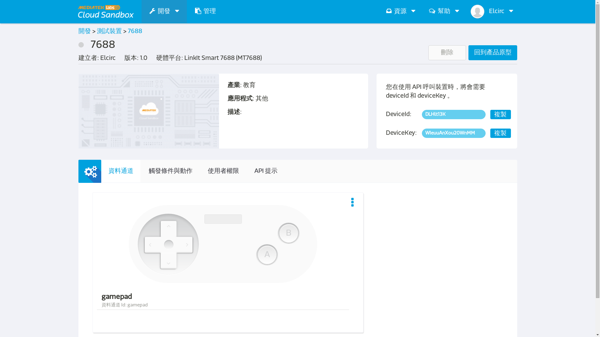

# MCS設定

1. 首先我們先登入我們的雲端MediTek Cloud Sandbox

    * 網址：https://mcs.mediatek.com/zh-TW/

    

    * 點選登入,進到console端裡面

    

2. 建立開發原形

    * 進入開發，新建立一個開發原型

    

    * 編輯原型

    

    * 進入原型

    

3. Gamepad資料通道

    * 新增資料通道

    

    * 新增控制器，選擇遊戲控制器,
      並設定自己想要的按鍵對應。這裡再提醒一次,
      __資料通道名稱__是給雲端網站代表資料通道用的,
      而__資料通道Id__是給機器辨識用的，所以要用英文。

    

    * 完成後點選測試裝置，並新增一個測試裝置

    
    
    
    * 右上角的__DeviceId__跟__DeviceKey__非常重要，
      他們扮演的角色就是待會7688要跟MCS雲端溝通的通行證。

