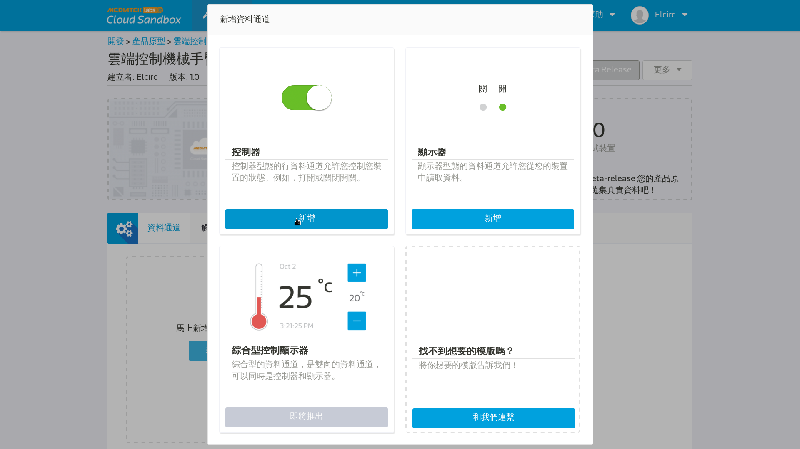

# MCS手臂控制設定

* 接下來我們將繼續編輯同一個開發原形，
  並新增另外一個資料通道，
  因為機械手臂部份有三顆馬達，
  所以為了方便控制，
  我們選擇新增Gamepad控制器，
  其操作起來就像一般的遊戲手把一樣。

* Gamepad資料通道

    * 新增資料通道

    

    * 新增控制器，選擇遊戲控制器,
      並設定自己想要的按鍵對應名稱。

    

   *  建議按照圖中示範的設定，
      因為這些按鍵所對應到的名稱待會還會用到，
      當然您也可以按照喜歡的方式去設定，
      但請記得要在待會的程式中修改成您設定的名稱。

    

