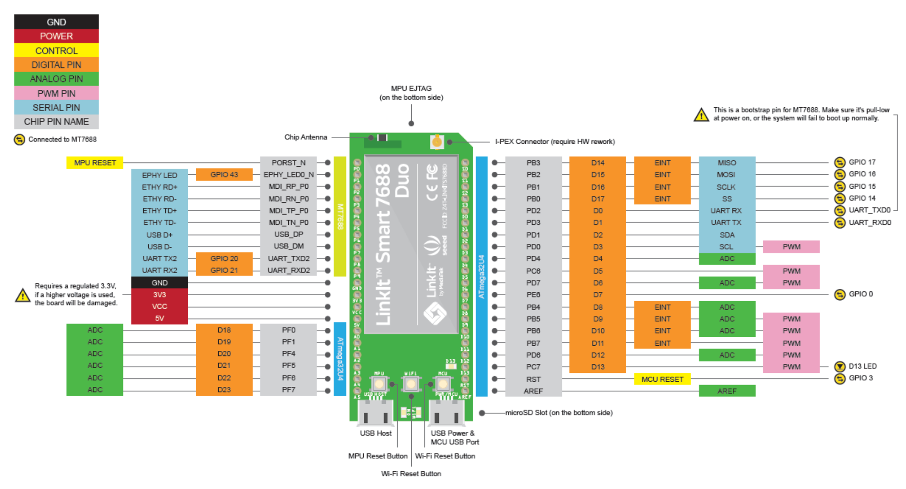
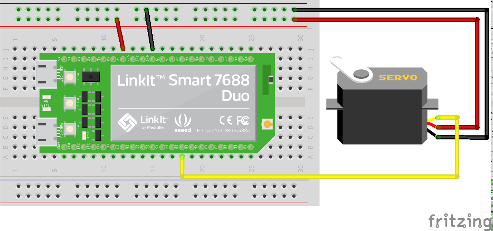

# 伺服馬達介紹

* 市面上常見的直流馬達其作動原理，
  乃透過在線圈中通過電流產生磁場，
  並與外圈的永久磁鐵產生力的作用而旋轉。

  
  <center><i>來源：維基百科</i></center>


* 但是一般馬達只有方向及轉速上可以調控，
  如果想要讓機械手臂能夠作到像我們人的手臂一樣能夠做出特定的姿勢，
  就必須精確的控制每顆馬達所轉的角度。
  於是在馬達上安裝編碼器及控制迴路的伺服馬達就出現了。

  
  <center><i>常見的小型塑膠齒伺服馬達TowerPro SG90</i></center>


* 一般來說伺服馬達會有三條線，分別有電源線，地線，及訊號線，
  控制上通常會用__PWM訊號__來控制馬達轉到的角度，
  PWM（Pluse Width Modulation），中文：脈衝寬度調變。
  是一種用數位訊號來代替類比訊號的方式，
  透過固定脈波週期，然後改變佔空比來對應到不同的類比訊號大小。
  在伺服馬達控制上，我們就可以將不同的佔空比對應到馬達不同的角度。
  例如：輸入1.5微秒的脈波給伺服馬達，
  它就會自己轉到中間的位置，並固定在那邊。
  為了輸出PWM訊號，我們在接線時必須接到7688板子上特定的PWM腳位，
  分別有3，5，6，9，10，11，12，13，一共八個腳位。

  

* 接下來我們就來實際測試看看，
  請先按下圖完成機械手臂夾爪的伺服馬達的電路，
  並在您的電腦上開啟Arduino IDE，
  並下載本範例程式到7688上執行。

  
  

* 7688_pwm_test.ino
```c
#include <Servo.h>
Servo s;
void setup()
{
    s.attach(3);
}

void loop()
{
    for(i = 30; i <= 150; i++)
    {
        s.write(i);
        delay(20);
    }
    for(i = 150; i >= 30; i--)
    {
        s.write(i);
        delay(20);
    }
}
```

* 是不是能夠成功看到機械手臂的夾爪開合開合呢？
